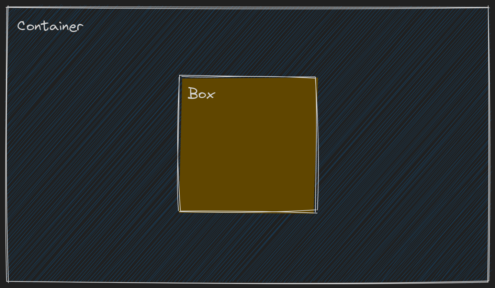

# Centering an element in a div

---

## Both Horizontally and Vertically

<p align="center" width="100%">
     
</p>

<details>
<summary>Click here to expand</summary>

### 1. If width and height of the box is fixed

<details>
<summary>Reveal Answer</summary>
   
   **Using Position and Margin Property**
   **Code**
  ```css
    .container {
        position: relative;
        height: 100vh;
    }
    .box {
        position: absolute;
        top: 50%;
        left: 50%;
        margin: -50px -50px; 
        /* margin: x-axis y-axis;
        here -50px refers to half of box width and height */
        width: 100px;
        height: 100px;
        background: #000;
    }
  ```
</details>

### 2. If width and height of the box is unknown/dynamic

<details>
<summary>Reveal Answer</summary>
   
   **Using Position and Transform Property**
   **Code**
  ```css
    .container {
        position: relative;
        height: 100vh;
    }
    .box {
        position: absolute;
        top: 50%;
        left: 50%;
        width: 30%;
        height: 30%;
        background: #000;
        transform: translate(-50%,-50%);
        /* translate(x-axis, y-axis); 
        here -50% refers to half of box width and height */
    }
  ```
</details>

### 3. Using flex

<details>
<summary>Reveal Answer</summary>

**Code**

```css
.container {
  display: flex;
  align-items: center;
  /* aligns box to center vertically */
  justify-content: center;
  /* aligns box to center horizontally */
  height: 100vh;
}
.box {
  width: 50%;
  height: 50%;
  background: #000;
}
```

</details>

### 4. Using grid

<details>
<summary>Reveal Answer</summary>
   
   **Code**
  ```css
    .container {
        display: grid;
        align-items: center;
        /* aligns box to center vertically */
        justify-items: center;
        /* aligns box to center horizontally */
        /* place-items:center;  
        combining both align and justify properties */ 
        height: 100vh;
    }
    .box {
        width: 50%;
        height: 50%;
        background: #000;
    }
  ```
</details>

> [Codepen Link for Centering a Div](https://codepen.io/SahulKola/pen/MWZPemG)

</details>

---

<footer>

[Go Back](../README.md)

</footer>
